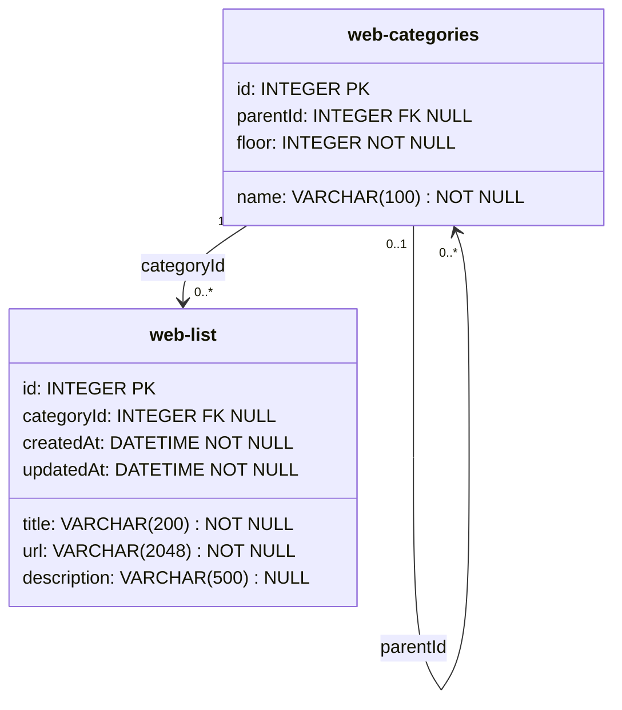

# APIControl 数据库结构

## `web-categories`

| 字段名 | 类型 | 允许为空 | 约束 | 用途 |
| --- | --- | --- | --- | --- |
| `id` | INTEGER | 否 | 主键、自增 | 分类唯一标识 |
| `name` | VARCHAR(100) | 否 | 同一父分类下名称不可重复 | 分类名称 |
| `parentId` | INTEGER | 是 | 外键，指向 `web-categories.id` | 根分类为空，子分类指向父分类 |
| `floor` | INTEGER | 否 | 根分类为 1，子分类为父分类层级加 1 | 分类所在层级 |

当前版本在业务层限制 `floor <= 2`。分类树整理逻辑按实际 `floor` 动态分组，可以兼容未来开放更多层级。

## `web-list`

| 字段名 | 类型 | 允许为空 | 约束 | 用途 |
| --- | --- | --- | --- | --- |
| `id` | INTEGER | 否 | 主键、自增 | 网址唯一标识 |
| `title` | VARCHAR(200) | 否 | 必填 | 网址名称 |
| `url` | VARCHAR(2048) | 否 | 必填 | 完整链接 |
| `description` | VARCHAR(500) | 是 | 可为空 | 网址简介 |
| `categoryId` | INTEGER | 是 | 外键，指向 `web-categories.id` | 所属分类，可为空 |
| `createdAt` | DATETIME | 否 | 创建时写入 | 创建时间 |
| `updatedAt` | DATETIME | 否 | 更新时写入 | 更新时间 |

删除分类时，如果分类下仍有关联网址，业务层会直接返回错误并阻止删除。
