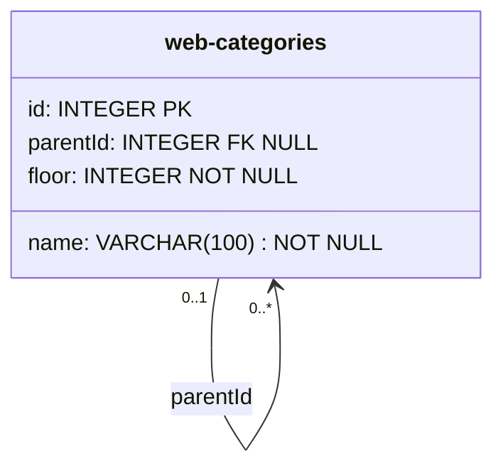

# APIControl 数据库结构

## `web-categories`

| 字段名 | 类型 | 允许为空 | 约束 | 用途 |
| --- | --- | --- | --- | --- |
| `id` | INTEGER | 否 | 主键、自增 | 分类唯一标识 |
| `name` | VARCHAR(100) | 否 | 同一父分类下名称不可重复 | 分类名称 |
| `parentId` | INTEGER | 是 | 外键，指向 `web-categories.id` | 根分类为空，子分类指向父分类 |
| `floor` | INTEGER | 否 | 根分类为 1，子分类为父分类层级加 1 | 分类所在层级 |

当前版本在业务层限制 `floor <= 2`。分类树整理逻辑按实际 `floor` 动态分组，可以兼容未来开放更多层级。
